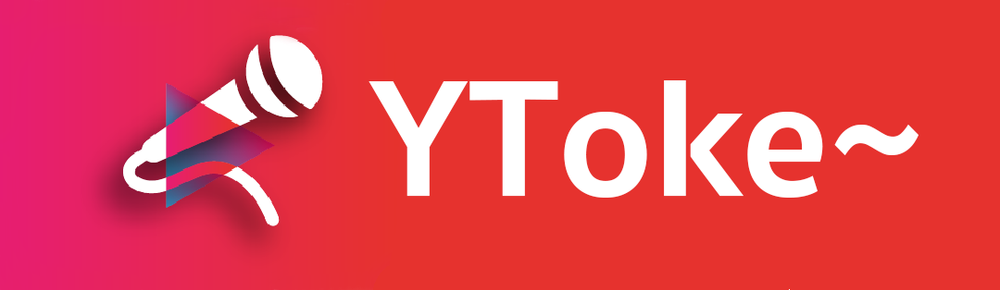

 

YToke~ is an Open Source free karaoke app on Mac. Connect external microphone to your Mac, YToke~ streams your voice to audio output. Enjoy living room karaoke by connecting Mac to your TV screen.

YToke~ uses Youtube videos as source of MVs, enjoy millions of songs with/without vocal and free of ads.

## Download
You can download the app on Github releases.

[GitHub Releases](https://github.com/YuantongL/YToke/releases)

## Setup
YToke~ has 2 windows - a control panel and a video view. Ideal setup would be use a TV as extended screen for playing the MV, and have the control panel on Mac display, just similar to what you have in a KTV room.

* Multiple microphone setup: You can use Mac's built-in "Audio MIDI setup" app to combine input from multiple microphones. [Apple's official guide](https://support.apple.com/en-us/HT202000)
* Prefer use wired external microphone as audio input to minimize latency.
* Latency is critical in karaoke, don't use Airplay, always prefer wired connection. Some TV has mode selections (most seen in game mode) to minimize latency.
* Use of Mac built-in microphone + speaker may cause howling.

## Run the project in Xcode
The project uses Cocoapods for package management.

* Run ``$ pod install`` under project root.

* Open the ``.workspace`` file generated by previous step, you should be able to just run the project by press ``command+R``.

## How does it work
The initial idea is to build a home karaoke system, Youtube is the world's largest video repository and there are a lot of karaoke videos, it make sense to use Youtube as the source of the videos.

YToke~ uses [Invidious API](https://github.com/iv-org/invidious) instead of Youtube's official data API for searching purpose, informations along with videoId is gathered. Then the videoId is passed to [XCDYouTubeKit](https://github.com/0xced/XCDYouTubeKit) to play.

Meanwhile, I created a MicStreamer based on [AVAudioEngine](https://developer.apple.com/documentation/avfoundation/avaudioengine) which basically does realtime audio processing. It connects the Mac's default audio input to output with little audio effect.

The app can be separate to 3 layers with unit-test covered on all layers.

* Data - Data providers, direct communicate to data sources.
* Repository - Contains logic for manipulating the data providers.
* View - Draws the UI, handles interaction and view layer logics.

The UI is built using AppKit + MVVM.

## Donation
If you enjoy singing with YToke~, besides contribute you are also welcome to donate. Your support push us develop new features and bring fantastic at-home Karaoke experience to you in the future.

[Donate](https://www.paypal.com/biz/fund?id=L3P7NAM2MZLDS)

## Contact
If you have questions or found bugs, feel free to create issue here on Github.

You can also follow up by reading the blog https://write.as/ytoke/.

## License

YToke~ is a open source app. The software is under the terms of the
[GNU General Public License V3](https://www.gnu.org/licenses/gpl-3.0.en.html).

